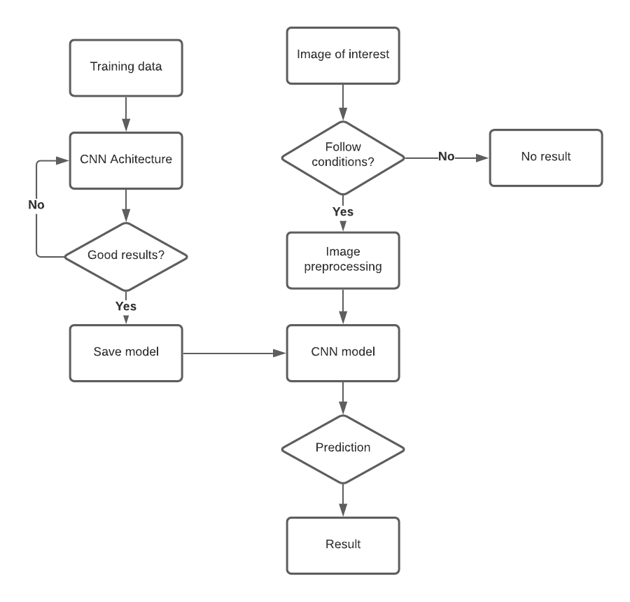
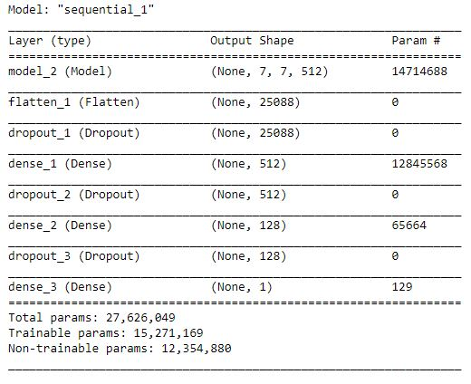
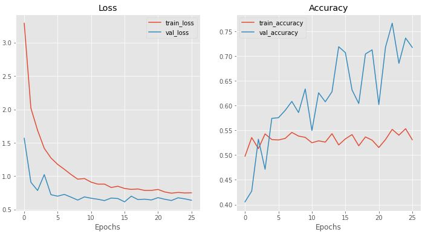
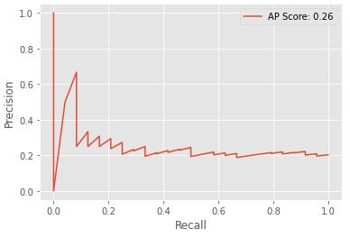
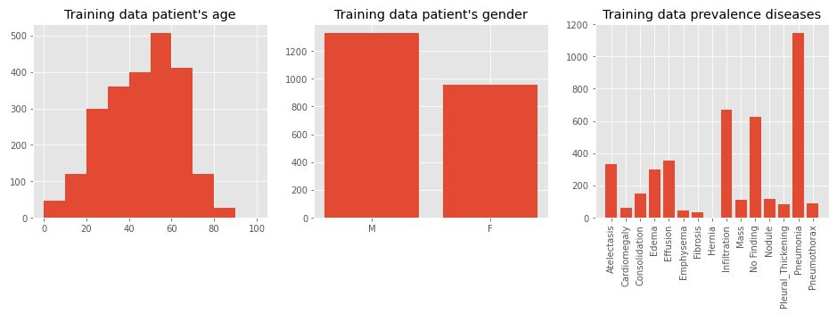
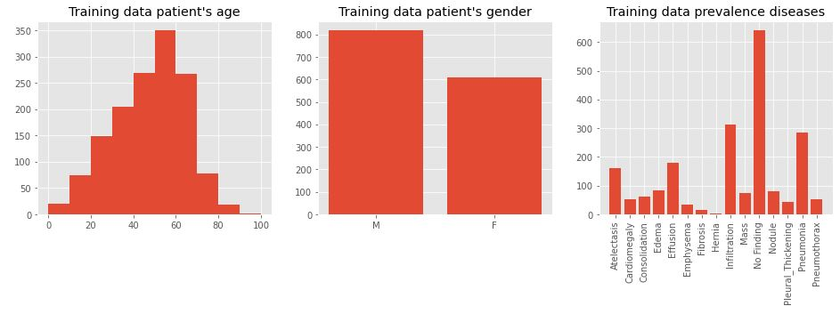

# FDA  Submission

**Your Name:** Eduard Ruiz Munné

**Name of your Device:** Pneumonia classification algorithm asistant (PCAA)

## Algorithm Description 

### 1. General Information

**Intended Use Statement:** 

Algorithm to classify x-ray images from the thorax to diagnose possible cases of pneumonia in patients for screening purpose.

**Indications for Use:**

- Available in all patients with independency of their age. 
- Both genders can be classified.
- Images from both AP and PA positions are required.
- Compatible with other diseases and people with more than one disease.
- Thorax x-ray images are needed.

**Device Limitations:**

- Does not work with other pacient positions different from anteroposterior (AP) and posteroanterior (PA).
- Does not work with images that are not from thorax.
- Problems in diagnosis of with emphysema, pneumothorax and pleural thickening because their intensity distributions are quite similar.

**Clinical Impact of Performance:**

Is an asistant algorithm which has to support ragiologist opinion, so false positive and false negatives can have influece in the opinion of the radiologist.

In the case of false positives, can produce wrong treatments which some of them can be counterproductive for the patient. False negatives instead will be sent home and will have to wait more time to get a treatment which in case of pneumonia can be fatal. Both have to be controlled to avoid possible physical and mental problems.

The algorithm presents a really high level of FP (specificity of 21.6%) but really low FN (sensitivity of 92.3%) as told the confusion matrix done with the validation data. This are correct numbers for screening procedure because we will avoid false negatives which, as it's said, can extend the disease and worsen the forecast. However, the large amount of false positives will make the algorithm not useful to start a treatment but yes to avoid healthy people wait for days to get the results. All positive cases determined by the algorithm must be check by a radiologist to confirm the diagnostic.

### 2. Algorithm Design and Function

**Algorithm Flowchart:**

**DICOM Checking Steps:**

1. Check the body part of the image (has to be CHEST).
2. Check the position of the patient (two possibilites, AP or PA).
3. Check the modality which has to be DX.

**Preprocessing Steps:**

Training images:
- Zero-mean by substracting the mean to all the values in the image.
- Aumentation of the image with different parameters.

Test images:
- Zero-mean by substracting the mean to all the values in the image.

**CNN Architecture:**

### 3. Algorithm Training

**Parameters:**
* Types of augmentation used during training
    - Horizontal flip
    - Height shift range = 0.25
    - Width shift range = 0.15
    - Rotation: 15º
    - Shear range = 0.15
    - Zoom range = 0.2
* Batch size: 64
* Optimizer learning rate: SGD with learning rate of 1e-4
* Layers of pre-existing architecture that were frozen:
    - input_1
    - block1_conv1
    - block1_conv2
    - block1_pool
    - block2_conv1
    - block2_conv2
    - block2_pool
    - block3_conv1
    - block3_conv2
    - block3_conv3
    - block3_pool
    - block4_conv1
    - block4_conv2
    - block4_conv3
    - block4_pool
    - block5_conv1
    - block5_conv2
* Layers of pre-existing architecture that were fine-tuned:
    - block5_conv3
    - block5_pool
* Layers added to pre-existing architecture:
    - Dense (512)
    - Dropout
    - Dense (128)
    - Dropout
    - Dense (1): sigmoid activation

**Algorithm training performance:**

The training loss decreased during epochs while the accuracy increased a little bit due to an overfitting process that has to be avoided. A total of around 55% accuracy in training dataset was obtained.

**P-R curve:**

When increasing the precision, the recall started to decrease with an stable behavior.

**Final Threshold and Explanation:**

The threshold of 0.43 has been selected because the f1-score it's maximum at that value.

### 4. Databases

112,120 frontal-view chest X-ray PNG images in 1024x1024 resolution which will be splitted into training and validation.

**Description of Training Dataset:** 

Same amount of pneumonia and non-pneumonia in the dataset. 80% of all the pneumonia cases. Approximately 1100 images from both classes selected randomly.

Most of the patients where from 20 to 70 years old with a predominance of males. However, the number of females exceed 900 which is a considerable amount. The most prevalent disease is pneumonia followed by infiltration and those with no found diseases.

**Description of Validation Dataset:** 

20% of pneumonia and 80% of non-pneumonia in the dataset. Selected randomly and allow to know the accuracy and other methods of our dataset.

The validation dataset also has a normal distribution of ages with dominance of patients older than 20 and younger than 70. The proportion of males and females is similar to the training's one and instead, not finding is the most prevalent disease followed by pneumonia and infiltration.

### 5. Ground Truth

Radiologist reports from x-ray images which different diseases were labeled with Natural Language Processing (NLP) to obtain the disease for each image which can include errors and have an impact on the algorithm performance.

### 6. FDA Validation Plan

**Patient Population Description for FDA Validation Dataset:**

The population from the FDA validation dataset needs to accomplish the following parameters:
- Patients from both genders
- Images from AP and PA positions.
- DX images.
- Images from the thorax.
- 50% of pneumonia cases would be an ideal prevalence for the dataset because the training was made with that proportion.

**Ground Truth Acquisition Methodology:**

Radiologist diagnostic from x-ray images where by a system of votes to reduce possible errors. This method is also known as silver standard.

**Algorithm Performance Standard:**

Radiologist performance of 0.387 F1-Score (Pranav Rajpurkar; CheXNet: Radiologist-Level Pneumonia Detection on Chest X-Rays
with Deep Learning) which is similar to our result of 0.38 which indicates that the algorithm has similar performance to radiologists validating our good results.